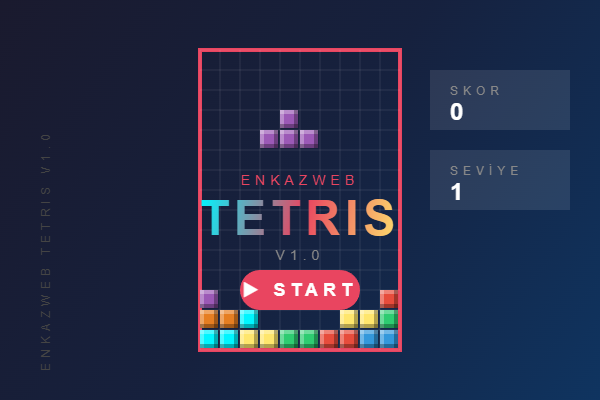

# 🎮 Enkazweb Tetris V1.0

Farcaster Mini App olarak geliştirilen, mobil uyumlu klasik Tetris oyunu.



## 🚀 Özellikler

- ✅ Klasik Tetris oyun mekaniği
- ✅ Mobil dokunmatik kontroller
- ✅ Klavye desteği (ok tuşları)
- ✅ Canvas üzerinde swipe kontrolü
- ✅ Seviye sistemi (her 10 satırda seviye atlama)
- ✅ Artan hız (seviye arttıkça oyun hızlanır)
- ✅ Sonraki parça önizlemesi
- ✅ Skor, seviye ve satır takibi
- ✅ Start ekranı ve animasyonlu arka plan
- ✅ Farcaster Mini App uyumlu
- ✅ Base App uyumlu

## 🎯 Nasıl Oynanır?

### Mobil Kontroller
| Buton | İşlev |
|-------|-------|
| ◀ | Sola hareket |
| ▶ | Sağa hareket |
| ▼ | Hızlı düşür |
| ↻ | Döndür |

### Klavye Kontroller
| Tuş | İşlev |
|-----|-------|
| ← | Sola hareket |
| → | Sağa hareket |
| ↓ | Hızlı düşür |
| ↑ | Döndür |
| Enter/Space | Oyunu başlat |

### Touch Kontroller (Ekran üzerinde)
- **Ekrana dokun (tap):** Döndür
- **Sağa kaydır:** Sağa hareket (sürekli)
- **Sola kaydır:** Sola hareket (sürekli)
- **Aşağı kaydır:** Hızlı düşür

## 📊 Puanlama

| Satır | Puan (× Seviye) |
|-------|-----------------|
| 1 satır | 100 |
| 2 satır | 300 |
| 3 satır | 500 |
| 4 satır (Tetris!) | 800 |

## 🛠️ Kurulum

```bash
# Bağımlılıkları yükle
npm install

# Geliştirme sunucusunu başlat
npm run dev
```

Tarayıcıda http://localhost:3000 adresini aç.

## 📁 Dosya Yapısı

```
BaseTetris/
├── index.html          # Ana HTML dosyası
├── style.css           # Stiller
├── game.js             # Oyun mantığı
├── icon.html           # İkon oluşturucu
├── icon.png            # Uygulama ikonu (200x200)
├── preview.png         # Önizleme görseli (600x400)
├── package.json        # NPM yapılandırması
└── .well-known/
    └── farcaster.json  # Farcaster yapılandırması
```

## 🎨 Tetris Parçaları

| Parça | Renk | Şekil |
|-------|------|-------|
| I | Cyan | ████ |
| O | Sarı | ██<br>██ |
| T | Mor | ░█░<br>███ |
| S | Yeşil | ░██<br>██░ |
| Z | Kırmızı | ██░<br>░██ |
| J | Mavi | █░░<br>███ |
| L | Turuncu | ░░█<br>███ |

## 🔧 Teknolojiler

- **HTML5 Canvas** - Oyun render
- **Vanilla JavaScript** - Oyun mantığı
- **CSS3** - Stiller ve animasyonlar
- **Farcaster Frame SDK** - Mini App entegrasyonu

## 🌐 Canlı Demo

🎮 **Oyna:** [tetris.enkazweb.com](https://tetris.enkazweb.com)

## 📱 Farcaster'da Oyna

1. Warpcast uygulamasını aç
2. Mini Apps bölümüne git
3. "Tetris" ara veya URL'i yapıştır

## 📄 Lisans

MIT License - Özgürce kullanabilirsiniz.

## 👨‍💻 Geliştirici

**Enkazweb**

---

⭐ Beğendiysen yıldız vermeyi unutma!
